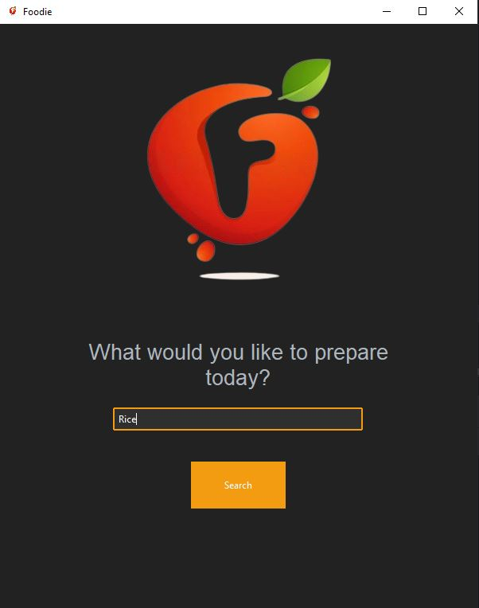
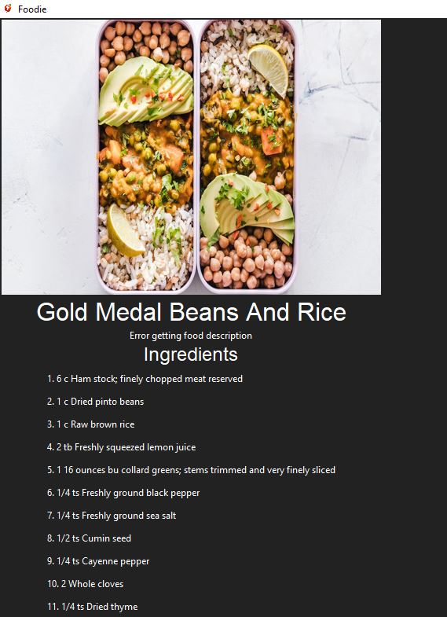
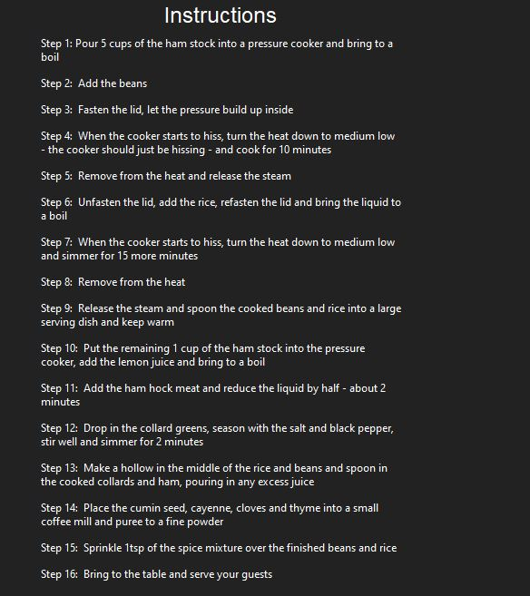

# FOODIE
The foodie app is a user friendly and efficient desktop application designed to make food preparation easy and more efficient through provision of simple to complex recipe in a simplified manner.
## Features

1. Food search variaties 
2. Food Menu reciepes

## Technologies, Languages and Tools used

- Pycharm
- TTK bootstrap Library
- Git
- VS Code
- API Ninja
- Wikipedia API
- Pexel API
- Tkinter
- Google Translator

## Encountered Challenges and future Features

- Working on the backend and database, so that users can login to view their progress

## How to install and run the project

- Fork the project and clone to your local machine
```bash
    git clone https://github.com/MaorBemdoo/Foodie
```
- Redirect to Foodie folder
```cmd
    cd Foodie
```
- Install the various libraries
```pip install
    Pip install ttkbootstrap python-dotenv pillow beautifulsoup4 googletrans==4.0.0-rc1 aiohttp
```
- Run the application (Current file)

## APP SHOWCASE

<div align="center">
    
    
    
    

</div>

## Authors
- Maor Bemdoo  -   ------------ BHU/23/04/05/0068
- Adamu Jighjigh------------- BHU/23/04/09/0080
- Stephenie Bitram Boyi---- BHU/23/04/09/0074
- Ibrahim Daniel---------------BHU/23/04/05/0076
- Elias Esther ----------------- BHU/23/01/07/0044
## Support

Give this repo a ⭐ if you like it

## License

This repo is protected by the [MIT](LICENSE) License
